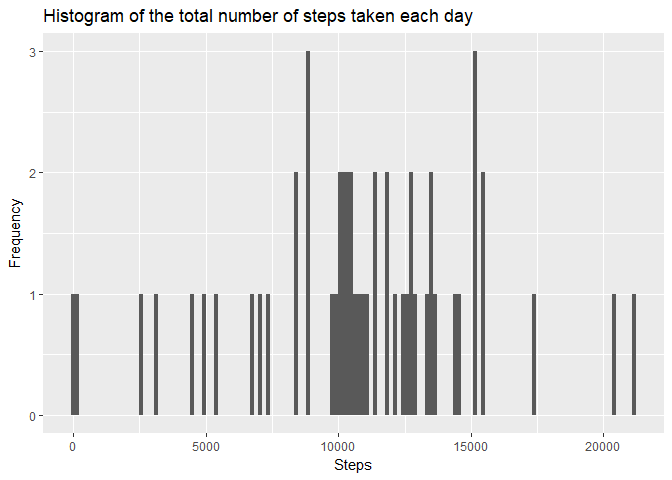
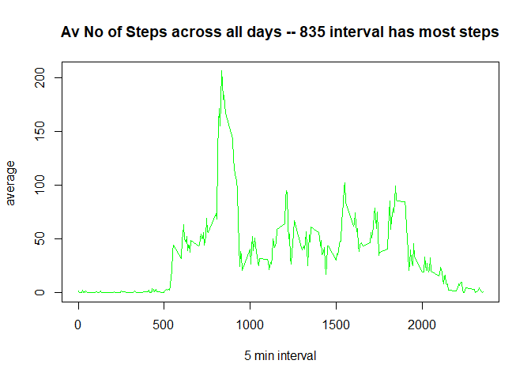
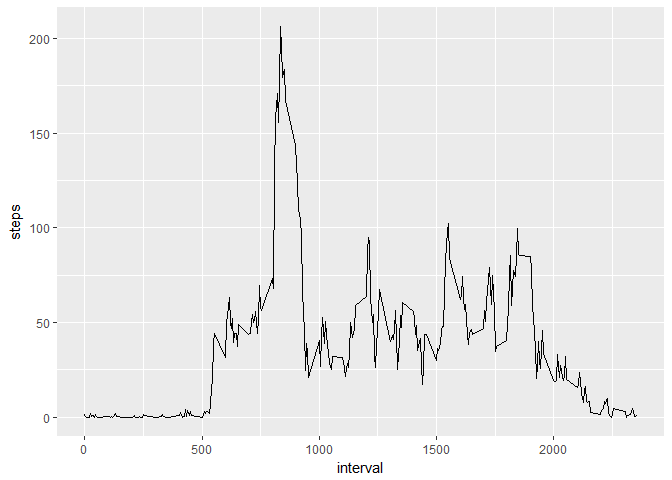
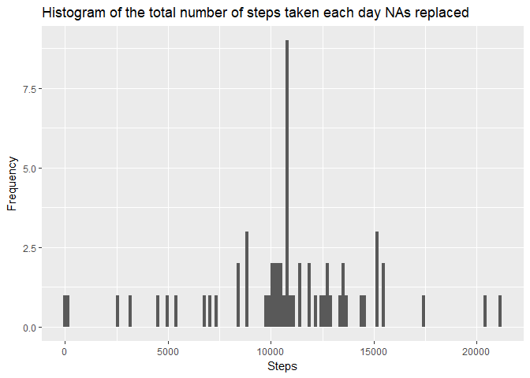
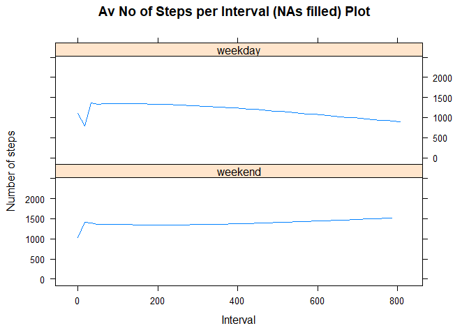

# Proj for Week2 of Reproducible Research


```r
knitr::opts_chunk$set(echo = TRUE)
```
This is an R Markdown document. The aim of the document is to answer all the questions set in Week 2 of the Data Science module called Reproducible Research.


```r
install.packages("plyr", repos = "http://cran.us.r-project.org")
```

```
## package 'plyr' successfully unpacked and MD5 sums checked
## 
## The downloaded binary packages are in
## 	C:\Users\zehra\AppData\Local\Temp\Rtmp8gf5CE\downloaded_packages
```

```r
library("plyr")
```

```
## Warning: package 'plyr' was built under R version 3.3.3
```

```r
install.packages("ggplot2", repos = "http://cran.us.r-project.org")
```

```
## package 'ggplot2' successfully unpacked and MD5 sums checked
## 
## The downloaded binary packages are in
## 	C:\Users\zehra\AppData\Local\Temp\Rtmp8gf5CE\downloaded_packages
```

```r
library("ggplot2")
```

```
## Warning: package 'ggplot2' was built under R version 3.3.3
```

```r
install.packages("dplyr", repos = "http://cran.us.r-project.org")
```

```
## package 'dplyr' successfully unpacked and MD5 sums checked
## 
## The downloaded binary packages are in
## 	C:\Users\zehra\AppData\Local\Temp\Rtmp8gf5CE\downloaded_packages
```

```r
library("dplyr")
```

```
## Warning: package 'dplyr' was built under R version 3.3.3
```


**Question**
Loading and preprocessing the data

Show any code that is needed to

Load the data (i.e. read.csv())

Process/transform the data (if necessary) into a format suitable for your analysis

**To do this :**
-read in the csv data

-tidy the data so every row has a value in each column


```r
getwd()
```

```
## [1] "C:/Users/zehra/Documents/Coursera"
```

```r
setwd("C:/Users/zehra/Documents/Coursera")
temp <- tempfile()
download.file("https://d396qusza40orc.cloudfront.net/repdata%2Fdata%2Factivity.zip",temp)
unzip(temp, "activity.csv")
activity<- read.csv("activity.csv",header=TRUE, sep = ",",fill = TRUE,quote="\"",strip.white = TRUE, stringsAsFactors = FALSE)
summary(activity)
```

```
##      steps            date              interval     
##  Min.   :  0.00   Length:17568       Min.   :   0.0  
##  1st Qu.:  0.00   Class :character   1st Qu.: 588.8  
##  Median :  0.00   Mode  :character   Median :1177.5  
##  Mean   : 37.38                      Mean   :1177.5  
##  3rd Qu.: 12.00                      3rd Qu.:1766.2  
##  Max.   :806.00                      Max.   :2355.0  
##  NA's   :2304
```

```r
activity_df <- na.omit(activity)
summary(activity_df)
```

```
##      steps            date              interval     
##  Min.   :  0.00   Length:15264       Min.   :   0.0  
##  1st Qu.:  0.00   Class :character   1st Qu.: 588.8  
##  Median :  0.00   Mode  :character   Median :1177.5  
##  Mean   : 37.38                      Mean   :1177.5  
##  3rd Qu.: 12.00                      3rd Qu.:1766.2  
##  Max.   :806.00                      Max.   :2355.0
```

```r
str(activity_df)
```

```
## 'data.frame':	15264 obs. of  3 variables:
##  $ steps   : int  0 0 0 0 0 0 0 0 0 0 ...
##  $ date    : chr  "2012-10-02" "2012-10-02" "2012-10-02" "2012-10-02" ...
##  $ interval: int  0 5 10 15 20 25 30 35 40 45 ...
##  - attr(*, "na.action")=Class 'omit'  Named int [1:2304] 1 2 3 4 5 6 7 8 9 10 ...
##   .. ..- attr(*, "names")= chr [1:2304] "1" "2" "3" "4" ...
```
**Question**
What is mean total number of steps taken per day?

-For this part of the assignment, you can ignore the missing values in the dataset.

-Calculate the total number of steps taken per day
If you do not understand the difference between a histogram and a barplot, research the difference between them.

Make a histogram of the total number of steps taken each day

**To do this :**
1.Already ommitted the NAs to get data frame (activity_df)

2.Sum up the setps per day (StepsSum)

3.Histogram to show the total number of steps taken each day using ggplot2 function

4.The bar chart/plot is used for categorical data and the bars can be ordered 
BUT a histogram shows continuous data and the distribution of variables.


```r
##make historgram
StepsSum<- aggregate(activity_df$steps, by=list(activity_df$date), FUN=sum)
ggplot(data=StepsSum, aes(StepsSum$x)) + geom_histogram(stat = "bin", binwidth=150)+
  xlab("Steps") + ylab("Frequency") +
  labs(title="Histogram of the total number of steps taken each day")
```

<!-- -->

**Question**
-Calculate and report the mean and median of the total number of steps taken per day

**To do this I will :**
1.Calculate the mean and median steps per day through use of 
aggregate function to work out the MEAN steps per day (StepsPerDate)


```r
library("plyr")
step_count <- count(activity_df, vars = c("steps"))
StepsPerDate<- aggregate(activity_df$steps ~ activity_df$date, activity_df, FUN=mean)
head(StepsPerDate, n=10)
```

```
##    activity_df$date activity_df$steps
## 1        2012-10-02           0.43750
## 2        2012-10-03          39.41667
## 3        2012-10-04          42.06944
## 4        2012-10-05          46.15972
## 5        2012-10-06          53.54167
## 6        2012-10-07          38.24653
## 7        2012-10-09          44.48264
## 8        2012-10-10          34.37500
## 9        2012-10-11          35.77778
## 10       2012-10-12          60.35417
```

```r
MedianSteps<- aggregate(activity_df$steps ~ activity_df$date, activity_df, FUN=median)
head(MedianSteps, n=10)
```

```
##    activity_df$date activity_df$steps
## 1        2012-10-02                 0
## 2        2012-10-03                 0
## 3        2012-10-04                 0
## 4        2012-10-05                 0
## 5        2012-10-06                 0
## 6        2012-10-07                 0
## 7        2012-10-09                 0
## 8        2012-10-10                 0
## 9        2012-10-11                 0
## 10       2012-10-12                 0
```
**Question**
What is the average daily activity pattern?

Make a time series plot (i.e. type = "l") of the 5-minute interval (x-axis) and the average number of steps taken, averaged across all days (y-axis)
Which 5-minute interval, on average across all the days in the dataset, contains the maximum number of steps?

**To do this:**
1.Convert the factor date col to the date class -- optional

2.Change the interval integer variable to a time variable


```r
library("plyr")
StepsPerInterv<- aggregate(activity_df$steps ~ activity_df$interval, activity_df, FUN=mean)
StepsPerInterv
```

```
##     activity_df$interval activity_df$steps
## 1                      0         1.7169811
## 2                      5         0.3396226
## 3                     10         0.1320755
## 4                     15         0.1509434
## 5                     20         0.0754717
## 6                     25         2.0943396
## 7                     30         0.5283019
## 8                     35         0.8679245
## 9                     40         0.0000000
## 10                    45         1.4716981
## 11                    50         0.3018868
## 12                    55         0.1320755
## 13                   100         0.3207547
## 14                   105         0.6792453
## 15                   110         0.1509434
## 16                   115         0.3396226
## 17                   120         0.0000000
## 18                   125         1.1132075
## 19                   130         1.8301887
## 20                   135         0.1698113
## 21                   140         0.1698113
## 22                   145         0.3773585
## 23                   150         0.2641509
## 24                   155         0.0000000
## 25                   200         0.0000000
## 26                   205         0.0000000
## 27                   210         1.1320755
## 28                   215         0.0000000
## 29                   220         0.0000000
## 30                   225         0.1320755
## 31                   230         0.0000000
## 32                   235         0.2264151
## 33                   240         0.0000000
## 34                   245         0.0000000
## 35                   250         1.5471698
## 36                   255         0.9433962
## 37                   300         0.0000000
## 38                   305         0.0000000
## 39                   310         0.0000000
## 40                   315         0.0000000
## 41                   320         0.2075472
## 42                   325         0.6226415
## 43                   330         1.6226415
## 44                   335         0.5849057
## 45                   340         0.4905660
## 46                   345         0.0754717
## 47                   350         0.0000000
## 48                   355         0.0000000
## 49                   400         1.1886792
## 50                   405         0.9433962
## 51                   410         2.5660377
## 52                   415         0.0000000
## 53                   420         0.3396226
## 54                   425         0.3584906
## 55                   430         4.1132075
## 56                   435         0.6603774
## 57                   440         3.4905660
## 58                   445         0.8301887
## 59                   450         3.1132075
## 60                   455         1.1132075
## 61                   500         0.0000000
## 62                   505         1.5660377
## 63                   510         3.0000000
## 64                   515         2.2452830
## 65                   520         3.3207547
## 66                   525         2.9622642
## 67                   530         2.0943396
## 68                   535         6.0566038
## 69                   540        16.0188679
## 70                   545        18.3396226
## 71                   550        39.4528302
## 72                   555        44.4905660
## 73                   600        31.4905660
## 74                   605        49.2641509
## 75                   610        53.7735849
## 76                   615        63.4528302
## 77                   620        49.9622642
## 78                   625        47.0754717
## 79                   630        52.1509434
## 80                   635        39.3396226
## 81                   640        44.0188679
## 82                   645        44.1698113
## 83                   650        37.3584906
## 84                   655        49.0377358
## 85                   700        43.8113208
## 86                   705        44.3773585
## 87                   710        50.5094340
## 88                   715        54.5094340
## 89                   720        49.9245283
## 90                   725        50.9811321
## 91                   730        55.6792453
## 92                   735        44.3207547
## 93                   740        52.2641509
## 94                   745        69.5471698
## 95                   750        57.8490566
## 96                   755        56.1509434
## 97                   800        73.3773585
## 98                   805        68.2075472
## 99                   810       129.4339623
## 100                  815       157.5283019
## 101                  820       171.1509434
## 102                  825       155.3962264
## 103                  830       177.3018868
## 104                  835       206.1698113
## 105                  840       195.9245283
## 106                  845       179.5660377
## 107                  850       183.3962264
## 108                  855       167.0188679
## 109                  900       143.4528302
## 110                  905       124.0377358
## 111                  910       109.1132075
## 112                  915       108.1132075
## 113                  920       103.7169811
## 114                  925        95.9622642
## 115                  930        66.2075472
## 116                  935        45.2264151
## 117                  940        24.7924528
## 118                  945        38.7547170
## 119                  950        34.9811321
## 120                  955        21.0566038
## 121                 1000        40.5660377
## 122                 1005        26.9811321
## 123                 1010        42.4150943
## 124                 1015        52.6603774
## 125                 1020        38.9245283
## 126                 1025        50.7924528
## 127                 1030        44.2830189
## 128                 1035        37.4150943
## 129                 1040        34.6981132
## 130                 1045        28.3396226
## 131                 1050        25.0943396
## 132                 1055        31.9433962
## 133                 1100        31.3584906
## 134                 1105        29.6792453
## 135                 1110        21.3207547
## 136                 1115        25.5471698
## 137                 1120        28.3773585
## 138                 1125        26.4716981
## 139                 1130        33.4339623
## 140                 1135        49.9811321
## 141                 1140        42.0377358
## 142                 1145        44.6037736
## 143                 1150        46.0377358
## 144                 1155        59.1886792
## 145                 1200        63.8679245
## 146                 1205        87.6981132
## 147                 1210        94.8490566
## 148                 1215        92.7735849
## 149                 1220        63.3962264
## 150                 1225        50.1698113
## 151                 1230        54.4716981
## 152                 1235        32.4150943
## 153                 1240        26.5283019
## 154                 1245        37.7358491
## 155                 1250        45.0566038
## 156                 1255        67.2830189
## 157                 1300        42.3396226
## 158                 1305        39.8867925
## 159                 1310        43.2641509
## 160                 1315        40.9811321
## 161                 1320        46.2452830
## 162                 1325        56.4339623
## 163                 1330        42.7547170
## 164                 1335        25.1320755
## 165                 1340        39.9622642
## 166                 1345        53.5471698
## 167                 1350        47.3207547
## 168                 1355        60.8113208
## 169                 1400        55.7547170
## 170                 1405        51.9622642
## 171                 1410        43.5849057
## 172                 1415        48.6981132
## 173                 1420        35.4716981
## 174                 1425        37.5471698
## 175                 1430        41.8490566
## 176                 1435        27.5094340
## 177                 1440        17.1132075
## 178                 1445        26.0754717
## 179                 1450        43.6226415
## 180                 1455        43.7735849
## 181                 1500        30.0188679
## 182                 1505        36.0754717
## 183                 1510        35.4905660
## 184                 1515        38.8490566
## 185                 1520        45.9622642
## 186                 1525        47.7547170
## 187                 1530        48.1320755
## 188                 1535        65.3207547
## 189                 1540        82.9056604
## 190                 1545        98.6603774
## 191                 1550       102.1132075
## 192                 1555        83.9622642
## 193                 1600        62.1320755
## 194                 1605        64.1320755
## 195                 1610        74.5471698
## 196                 1615        63.1698113
## 197                 1620        56.9056604
## 198                 1625        59.7735849
## 199                 1630        43.8679245
## 200                 1635        38.5660377
## 201                 1640        44.6603774
## 202                 1645        45.4528302
## 203                 1650        46.2075472
## 204                 1655        43.6792453
## 205                 1700        46.6226415
## 206                 1705        56.3018868
## 207                 1710        50.7169811
## 208                 1715        61.2264151
## 209                 1720        72.7169811
## 210                 1725        78.9433962
## 211                 1730        68.9433962
## 212                 1735        59.6603774
## 213                 1740        75.0943396
## 214                 1745        56.5094340
## 215                 1750        34.7735849
## 216                 1755        37.4528302
## 217                 1800        40.6792453
## 218                 1805        58.0188679
## 219                 1810        74.6981132
## 220                 1815        85.3207547
## 221                 1820        59.2641509
## 222                 1825        67.7735849
## 223                 1830        77.6981132
## 224                 1835        74.2452830
## 225                 1840        85.3396226
## 226                 1845        99.4528302
## 227                 1850        86.5849057
## 228                 1855        85.6037736
## 229                 1900        84.8679245
## 230                 1905        77.8301887
## 231                 1910        58.0377358
## 232                 1915        53.3584906
## 233                 1920        36.3207547
## 234                 1925        20.7169811
## 235                 1930        27.3962264
## 236                 1935        40.0188679
## 237                 1940        30.2075472
## 238                 1945        25.5471698
## 239                 1950        45.6603774
## 240                 1955        33.5283019
## 241                 2000        19.6226415
## 242                 2005        19.0188679
## 243                 2010        19.3396226
## 244                 2015        33.3396226
## 245                 2020        26.8113208
## 246                 2025        21.1698113
## 247                 2030        27.3018868
## 248                 2035        21.3396226
## 249                 2040        19.5471698
## 250                 2045        21.3207547
## 251                 2050        32.3018868
## 252                 2055        20.1509434
## 253                 2100        15.9433962
## 254                 2105        17.2264151
## 255                 2110        23.4528302
## 256                 2115        19.2452830
## 257                 2120        12.4528302
## 258                 2125         8.0188679
## 259                 2130        14.6603774
## 260                 2135        16.3018868
## 261                 2140         8.6792453
## 262                 2145         7.7924528
## 263                 2150         8.1320755
## 264                 2155         2.6226415
## 265                 2200         1.4528302
## 266                 2205         3.6792453
## 267                 2210         4.8113208
## 268                 2215         8.5094340
## 269                 2220         7.0754717
## 270                 2225         8.6981132
## 271                 2230         9.7547170
## 272                 2235         2.2075472
## 273                 2240         0.3207547
## 274                 2245         0.1132075
## 275                 2250         1.6037736
## 276                 2255         4.6037736
## 277                 2300         3.3018868
## 278                 2305         2.8490566
## 279                 2310         0.0000000
## 280                 2315         0.8301887
## 281                 2320         0.9622642
## 282                 2325         1.5849057
## 283                 2330         2.6037736
## 284                 2335         4.6981132
## 285                 2340         3.3018868
## 286                 2345         0.6415094
## 287                 2350         0.2264151
## 288                 2355         1.0754717
```

```r
##tidy col names in data frame we need for this part
names(StepsPerInterv)[names(StepsPerInterv) == 'activity_df$interval'] <- 'perInterval'
names(StepsPerInterv)[names(StepsPerInterv) == 'activity_df$steps'] <- 'avSteps'
##make the axes timeseries
StepsPerInterv$perInterval<- ts(StepsPerInterv$perInterval)
StepsPerInterv$avSteps<- ts(StepsPerInterv$avSteps)
##use the time series plot function
plot.ts(StepsPerInterv$perInterval, StepsPerInterv$avSteps, 
     type = "l", 
     col = "green", 
     lwd = 3,
     xlab = "5 min interval",
     ylab = "average ",
     main = "Av No of Steps across all days -- 835 interval has most steps")
```

<!-- -->

```r
library("ggplot2")
ggplot(StepsPerInterv, aes(perInterval, avSteps)) + geom_line() +
  xlab("interval") + ylab("steps")
```

```
## Don't know how to automatically pick scale for object of type ts. Defaulting to continuous.
## Don't know how to automatically pick scale for object of type ts. Defaulting to continuous.
```

<!-- -->

**835 is the interval with the highest number of steps.**


**Question**Imputing missing values
Note that there are a number of days/intervals where there are missing values (coded as NA). The presence of missing days may introduce bias into some calculations or summaries of the data.

Calculate and report the total number of missing values in the dataset (i.e. the total number of rows with NAs)

Devise a strategy for filling in all of the missing values in the dataset. The strategy does not need to be sophisticated. For example, you could use the mean/median for that day, or the mean for that 5-minute interval, etc.

**To do this:**
1.Check the activity data frame see where the NAs are , they are all in steps column
Use the sum function to get the no of NAs (NA_number)The total number of rows with NAs is 2304.

2.Get the rows with NAs to create a new df (NA_df)

3.Insert the mean steps to that NA_df to overwrite NAs


```r
##tidy col names in data frame we need for this part
names(StepsPerDate)[names(StepsPerDate) == 'activity_df$date'] <- 'perDate'
names(StepsPerDate)[names(StepsPerDate) == 'activity_df$steps'] <- 'avSteps'
##tidy col names in data frame we need for this part
names(StepsPerInterv)[names(StepsPerInterv) == 'activity_df$interval'] <- 'perInterval'
names(StepsPerInterv)[names(StepsPerInterv) == 'activity_df$steps'] <- 'avSteps'


##subset to find which rows have the NAs
NA_number <-sum(is.na(activity$steps))
NA_df <-activity[!complete.cases(activity), ]

names(NA_df)[names(NA_df)=="steps"] <- "avSteps"
names(NA_df)[names(NA_df)=="date"] <- "perDate"

##list/get the dates & can see these dates are not in StepsPerDate so use mean steps from interval df
date_in_df <- unique(NA_df$perDate)
NA_df$perDate <- as.Date(NA_df$perDate)

##Strategy for NAs --extract avSteps from StepsPerInterv& insert to NA_df-- NOTE this is a subset of activity df hence replacing all values
NA_df$avSteps <- StepsPerInterv[StepsPerInterv$perInterval %in% NA_df$interval,"avSteps"]
```
**Question**
Create a new dataset that is equal to the original dataset but with the missing data filled in.

Make a histogram of the total number of steps taken each day and

Calculate and report the mean and median total number of steps taken per day.

Do these values differ from the estimates from the first part of the assignment? 

What is the impact of imputing missing data on the estimates of the total daily number of steps? (step_total)

**To do this**
4.Replace NAs on activity to make new dataset called activity_complete - using replace function

5.Make the histogram (title="Histogram of the total number of steps taken each day NAs replaced")

6.Re-use the mean and median calcs

```r
summary(activity)
```

```
##      steps            date              interval     
##  Min.   :  0.00   Length:17568       Min.   :   0.0  
##  1st Qu.:  0.00   Class :character   1st Qu.: 588.8  
##  Median :  0.00   Mode  :character   Median :1177.5  
##  Mean   : 37.38                      Mean   :1177.5  
##  3rd Qu.: 12.00                      3rd Qu.:1766.2  
##  Max.   :806.00                      Max.   :2355.0  
##  NA's   :2304
```

```r
str(activity)
```

```
## 'data.frame':	17568 obs. of  3 variables:
##  $ steps   : int  NA NA NA NA NA NA NA NA NA NA ...
##  $ date    : chr  "2012-10-01" "2012-10-01" "2012-10-01" "2012-10-01" ...
##  $ interval: int  0 5 10 15 20 25 30 35 40 45 ...
```

```r
activity_complete<- activity

##rename the NA_Df cols to match the df we will fill in
colnames(NA_df) <- c("steps", "date","interval")

activity_complete$date <- as.Date(activity_complete$date)

##merge activity_complete and NA_df
##full_activity <- merge(activity_complete, NA_df, by=	c("date","interval"), all=TRUE,suffixes=c(".activity_complete", ".NA_df"))

##impute only missing values-- use the NA_df subset to get interval averages
activity_complete$steps[is.na(activity_complete$steps)] <- NA_df$steps

#remove empty cols
str(activity_complete)
```

```
## 'data.frame':	17568 obs. of  3 variables:
##  $ steps   : num  1.717 0.3396 0.1321 0.1509 0.0755 ...
##  $ date    : Date, format: "2012-10-01" "2012-10-01" ...
##  $ interval: int  0 5 10 15 20 25 30 35 40 45 ...
```

```r
##make histogram
StepsSum<- aggregate(activity_complete$steps, by=list(activity_complete$date), FUN=sum)
ggplot(data=StepsSum, aes(StepsSum$x)) + geom_histogram(stat = "bin", binwidth=150)+
  xlab("Steps") + ylab("Frequency") +
  labs(title="Histogram of the total number of steps taken each day NAs replaced")
```

<!-- -->

```r
##mean and median
StepsPerDate2<- aggregate(activity_complete$steps ~ activity_complete$date, activity_complete, FUN=mean)
head(StepsPerDate2, n=10)
```

```
##    activity_complete$date activity_complete$steps
## 1              2012-10-01                37.38260
## 2              2012-10-02                 0.43750
## 3              2012-10-03                39.41667
## 4              2012-10-04                42.06944
## 5              2012-10-05                46.15972
## 6              2012-10-06                53.54167
## 7              2012-10-07                38.24653
## 8              2012-10-08                37.38260
## 9              2012-10-09                44.48264
## 10             2012-10-10                34.37500
```

```r
MedianSteps2<- aggregate(activity_complete$steps ~ activity_complete$date, activity_complete, FUN=median)
head(MedianSteps2, n=10)
```

```
##    activity_complete$date activity_complete$steps
## 1              2012-10-01                34.11321
## 2              2012-10-02                 0.00000
## 3              2012-10-03                 0.00000
## 4              2012-10-04                 0.00000
## 5              2012-10-05                 0.00000
## 6              2012-10-06                 0.00000
## 7              2012-10-07                 0.00000
## 8              2012-10-08                34.11321
## 9              2012-10-09                 0.00000
## 10             2012-10-10                 0.00000
```

```r
##total daily number of steps
step_total <- count(activity_complete, vars = c("steps"))
```

**Comparison to data without NAs**

After using the mean step count per interval to impute missing values, we can see the total number of steps per day increases by 2394.

The histogram with NAs replaced shows that there is a distinct most frequent step count, this is not clear from the historgram omitting NAs.

The mean and median compared to the earlier mean and median of data set without NAs imputted: Median is no longer zero. 

Looking at both the data frames with imputted values and none: The same date has the highest average number of steps.
The same date has the lowest average number of steps. There are more averages (61) in the data set with imputted NAs.

**Question**

Are there differences in activity patterns between weekdays and weekends?

For this part the weekdays() function may be of some help here. Use the dataset with the filled-in missing values for this part.

Create a new factor variable in the dataset with two levels - "weekday" and "weekend" indicating whether a given date is a weekday or weekend day.

Make a panel plot containing a time series plot (i.e. type = "l") of the 5-minute interval (x-axis) and the average number of steps taken, averaged across all weekday days or weekend days (y-axis). See the README file in the GitHub repository to see an example of what this plot should look like using simulated data.


```r
str(activity_complete)
```

```
## 'data.frame':	17568 obs. of  3 variables:
##  $ steps   : num  1.717 0.3396 0.1321 0.1509 0.0755 ...
##  $ date    : Date, format: "2012-10-01" "2012-10-01" ...
##  $ interval: int  0 5 10 15 20 25 30 35 40 45 ...
```

```r
activity_complete$date <- as.Date(activity_complete$date)
weekdays <- c('Monday', 'Tuesday', 'Wednesday', 'Thursday', 'Friday')
#Use `%in%` and `weekdays` to create a logical vector
#convert to `factor` and specify the `levels/labels`
activity_complete$week_ind <- factor((weekdays(activity_complete$date) %in% weekdays),levels=c(FALSE, TRUE), labels=c('weekend', 'weekday'))

activity_complete$interval<- ts(activity_complete$interval)
activity_complete$steps<- ts(activity_complete$steps)

##use the time series plot function copying the format in: https://github.com/rdpeng/RepData_PeerAssessment1
library("lattice")

panel.smoother <- function(x, y) {
  ##panel.xyplot(x, y) # show points 
  panel.loess(x, y)  # show smoothed line 
  }

xyplot(activity_complete$interval ~ activity_complete$steps | activity_complete$week_ind, data = activity_complete,
  xlab = "Interval",
  ylab = "Number of steps",
  panel=panel.smoother,
  main = "Av No of Steps per Interval (NAs filled) Plot",
  layout=c(1,2)
 )
```

<!-- -->

This code was used to create the html document.
setwd("C:/Users/zehra/Documents/Coursera")

library(knitr)
library(markdown)
library(render)

#rmarkdown::render()
rmarkdown::render("PA1_template.Rmd",output_format = "html_document",output_dir = "C:/Users/zehra/Documents/Coursera")


